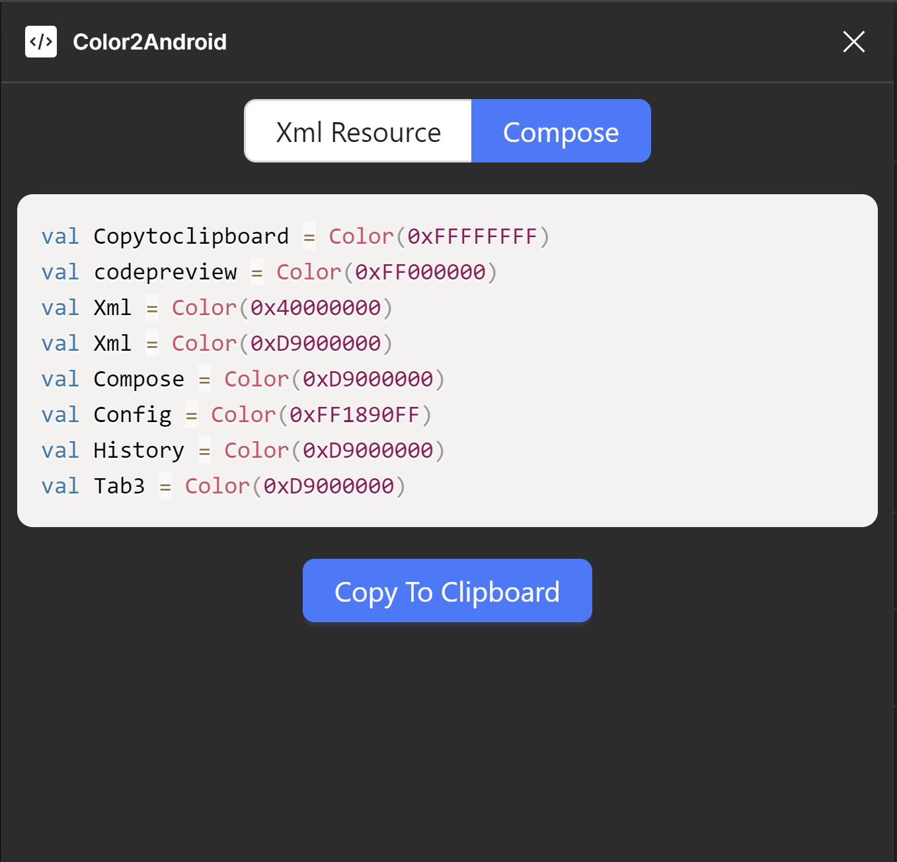

# TextColor2Android
该仓库为 [TextColor2Android](https://www.figma.com/community/plugin/1287346413780241146/textcolor2android) Figma 插件的源代码，可以在掘金上查阅到对应的技术 Blog

## 🎥 功能预览

## 🚀 快速开始
1. 将仓库 clone 到本地
    ```bash
    git clone https://github.com/sunnyswag/Color2Android.git
    ```
2. 处理相关依赖
    ```bash
    npm install pnpm
    pnpm install
    ```
## 💻 将该项目作为模板
参考掘金文章的 Color2Android 项目简介 小节，该小节描述了该项目的具体细节以及基于 Color2Android 进行二次开发的注意事项